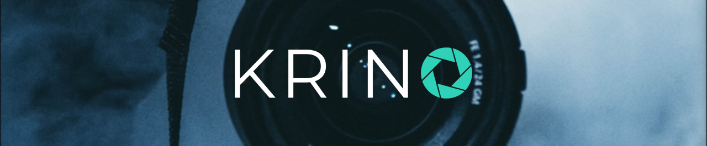

<!-------------------------------------------------------------------------------------------------------------------------->

A Full-stack project developed during the CodeDay CodeLabs internship.  
Platform where photographers can upload their photos, build their portfolio, and then have fellow photographers leave positive and constructive feedback on their work.

 

<!-------------------------------------------------------------------------------------------------------------------------->

## Table of Contents

* [Installation and Setup](#install)
* [Live Project Link](#live)
* [Technology Used](#tech)
* [Team Members](#team)

 

<!-------------------------------------------------------------------------------------------------------------------------->

##  Installation and Setup

Clone this repository into your local machine. 

> You will need `node` and `npm` installed globally.  
> Download them from https://nodejs.org/en/download/ and make sure to choose the “LTS” version.

Installing:

`npm install`

Starting the server:

`npm start`

Viewing the application:

`localhost:3000`

 

<!-------------------------------------------------------------------------------------------------------------------------->

##  Project Demo

Demo of the application can be viewed on :camera_flash: https://www.youtube.com/watch?v=TSCLADJ_OVs&t=7s (1:40) :camera_flash: 

 

<!-------------------------------------------------------------------------------------------------------------------------->

##  Technology Used

Frontend:&nbsp; &nbsp; &nbsp; &nbsp;

Backend:&nbsp; &nbsp; &nbsp; &nbsp;&nbsp;

Deployment:&nbsp;&nbsp;

Additional:&nbsp; &nbsp; &nbsp;

 

<!-------------------------------------------------------------------------------------------------------------------------->

##  Team Members
 * [Smilte Valasinaite](https://www.linkedin.com/in/smiltevalasinaite/)
 * [Amy Ghotra](https://www.linkedin.com/in/amyghotra/)
 * [Zarrin Ali](https://www.linkedin.com/in/%E2%9C%A8-zarrin-ali-%E2%9C%A8-2a04b3146/)
 * [Timothy Van Cleave (mentor)](https://www.linkedin.com/in/timothy-van-cleave/)
